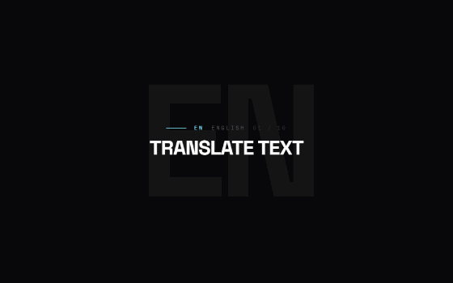
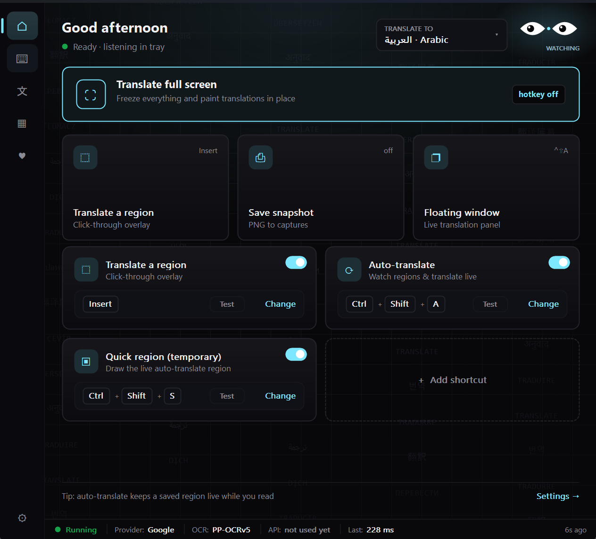
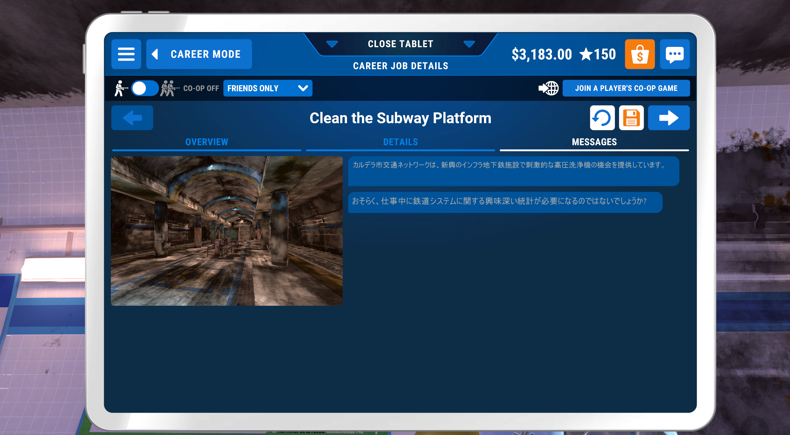

# ORB — Translate Anything on Your Screen

**See text in your language instantly.** Point at any screen text — whether it's a game, website, video, or document — and read the translation right there, in real time.

## What it does

✨ **Just works** — No setup, no accounts (for free engines), point and translate  
🌍 **12 languages** — Arabic, English, Chinese, Japanese, Spanish, French, German, Turkish, Russian, Korean, Persian, Urdu  
⚡ **Instant** — Translation appears in milliseconds, updates live as text changes  
🎮 **Built for gamers** — Gaming mode doesn't steal your FPS  
📖 **For readers** — Translate PDFs, web articles, eBooks, subtitles  
🔒 **Fully private** — Uses free services or your own API keys  

**Just works on:** game subtitles • web pages • chat & messages • PDFs • live streams • video captions

---

## Get Started (2 minutes)

**1. Download**  
Get `ORB.zip` from [Releases](https://github.com/lRoxl/ORB/releases)

**2. Extract & Run**  
- Unzip to any folder (Desktop, Documents, anywhere)
- Double-click `ORB.exe` — that's it
- No installation wizard, no admin rights needed

**3. Pick a translator** (optional)
- Free: Use Google + Yandex automatically (no account needed)
- Premium: Add your own API key (Claude, ChatGPT, DeepL) for higher quality

### System Requirements

✅ Windows 10 or 11 — that's all  
✅ 100 MB free space for the app  
✅ Internet connection (for translation)  

**Optional:** If you want to translate offline (no internet), download a local model (900 MB) inside the app

---

## How to Use It

### The 4 Main Hotkeys

| What | Key |
|------|-----|
| **Translate a region** | **Insert** — draw a box, see translation |
| **Auto-translate** | **Ctrl + Shift + A** — watch & auto-translate continuously |
| **Quick temporary region** | **Ctrl + Shift + S** — quick auto-translate (clears when done) |
| **Open translate page** | **F6** — type text or paste to translate |

### How It Works

**One-time translation:**
1. Press **Insert**
2. Draw a box on your screen
3. See the translation instantly

**Auto-translate (like subtitles):**
1. Press **Ctrl + Shift + A**
2. Draw a box around the text you want to watch
3. It translates automatically whenever text changes

**Quick translate:**
- Press **Ctrl + Shift + S** to auto-translate in a temporary box
- It clears automatically when done

**Type & translate:**
- Press **F6** to open the translate page
- Paste any text or type it manually

### Settings (Optional)

**🎯 Engine** — Where translations come from  
- Free (Google + Yandex auto-switch)  
- Premium (add your own Claude/ChatGPT/DeepL key)  
- Offline (download a local model, ~900 MB)  

**🎨 Look** — How it appears on screen  
- Flat box overlay  
- Blurred background  
- Movie-style subtitle card  

**⚙️ Performance**  
- Gaming mode: less CPU, better FPS  
- Cache translations: repeat text is instant  

**All settings optional** — defaults work great, change anytime

---

## Features that Matter

**🎮 Gaming** — Subtitles translate in real time without lag  
**📚 Reading** — Highlight any text and see translation instantly  
**💬 Chat** — Translate messages as they come in (Discord, Telegram, etc.)  
**🎬 Videos** — Understand dialogue even if subtitles aren't available  
**📄 Documents** — Translate PDFs, Word docs, web articles while you read  

**Real-world example: Gaming**

See Japanese game text (right side) automatically translated while you play.

**🌍 Supports:** Arabic · English · Chinese · Japanese · Korean · Spanish · French · German · Portuguese · Turkish · Russian · Persian · Urdu

**⚡ Speed**  
- Translation appears in 100 ms to 2 seconds  
- Smooth 60 FPS overlays (won't slow your game)  
- Works on modern and older computers  

**💾 Memory Friendly**  
- App: 100 MB  
- With offline model (optional): 900 MB total  
- Doesn't hog your RAM

---

## Screenshots

All three images above show:
1. **Intro animation** — smooth ORB branding
2. **Dashboard** — home page with all 4 hotkeys visible
3. **Game translation** — Japanese subtitles translated in real time (right panel)

The live translations never interrupt gameplay.

**"Hotkeys don't work"**  
→ Try pressing them again (sometimes needs 1 second)  
→ Different app already using that hotkey — change it in Settings  
→ In-game: might need to click inside the game window first, then press hotkey  

**"It's not reading the text"**  
→ Make sure you're selecting real text (not images or video)  
→ Try adjusting the box you draw — some text needs a bigger area  
→ In games: try Settings and toggle "Windows Capture"  

**"Translation is taking forever"**  
→ Free engines are sometimes slow — upgrade to a paid plan (DeepL, ChatGPT) for faster  
→ Enable "Gaming mode" in Settings  

**"App crashed / closed"**  
→ Check Settings → View Logs, copy the error message  
→ Post the error on [GitHub Issues](https://github.com/lRoxl/ORB/issues)  

**Need different language?**  
→ Press **Insert**, draw a region, then click the language dropdown at the top

**Still stuck?** → Open an issue on [GitHub](https://github.com/lRoxl/ORB/issues)

---

## Small Print

- Works best on Windows 10 & 11
- Needs internet (unless you download an offline model)
- Can't translate text inside videos/games with heavy GPU protection
- Text quality depends on screen resolution (bigger text = better)

---

## Feedback & Support

💬 **Found a bug?** → [Report it on GitHub](https://github.com/lRoxl/ORB/issues)  
❤️ **Like it?** → [Star the repo](https://github.com/lRoxl/ORB) or [donate](https://ko-fi.com)  
💡 **Have an idea?** → [Suggest a feature](https://github.com/lRoxl/ORB/issues)  

---

## What's New

**v1.0.2** — Auto-update, better subtitle rendering  
**v1.0.0** — First release

---

**Made for readers, gamers, and curious people everywhere** 🌍

Free, open-source, no tracking. Just useful software.

[GitHub](https://github.com/lRoxl/ORB) · [Donate]([https://ko-fi.com](https://ko-fi.com/lRoxl)) · 
